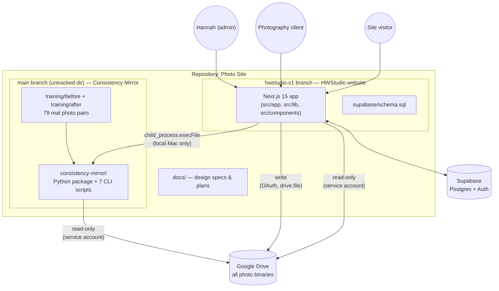
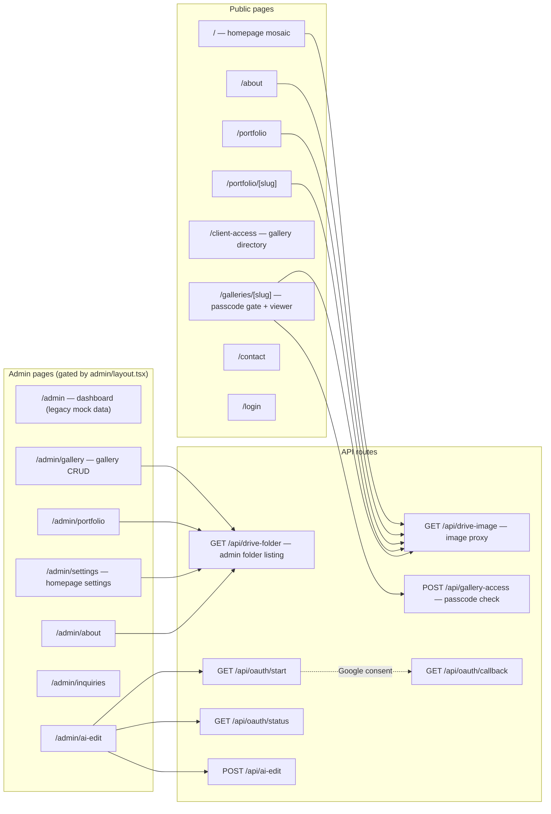
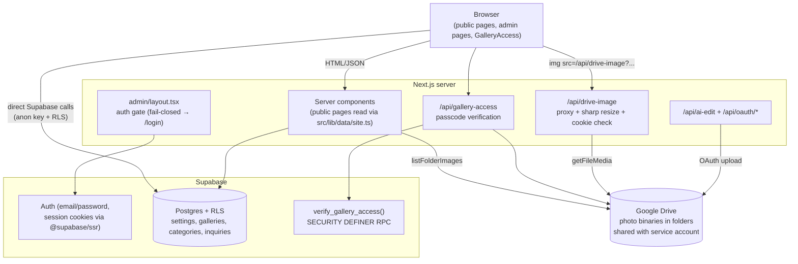
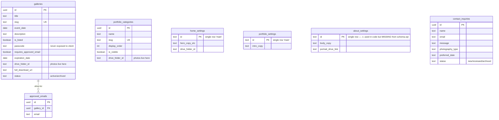
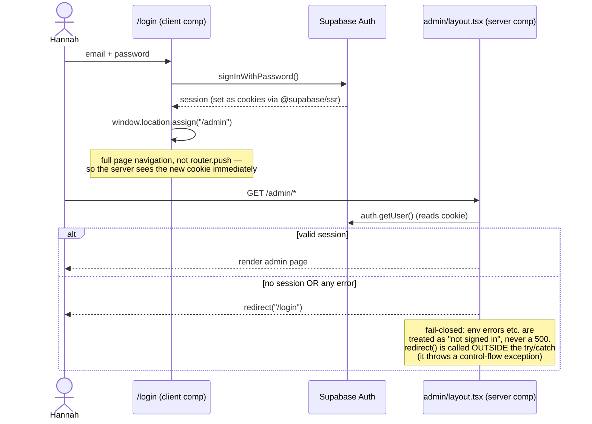
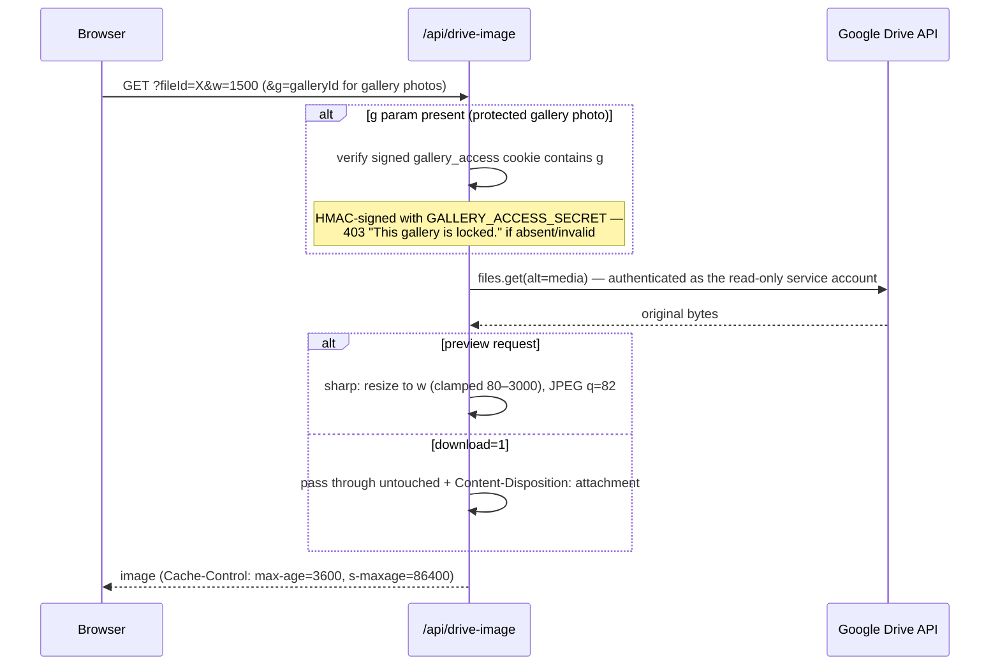
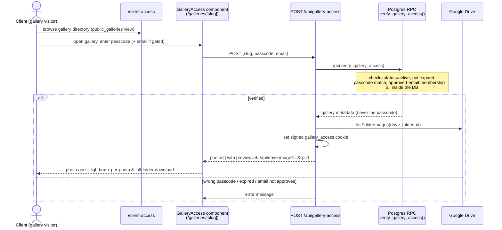
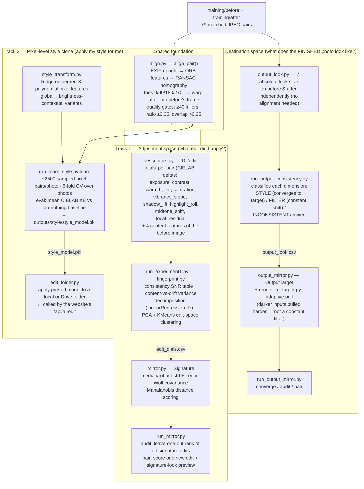

# Photo Site — System Architecture

> Audience: a developer joining the project. Diagrams are [Mermaid](https://mermaid.js.org/) — they render on GitHub and in VS Code's markdown preview.
>
> Last updated: 2026-07-18. Website code lives on the **`hwstudio-v1`** branch (worktree at `.worktrees/hwstudio-v1`); `main` holds docs and the untracked Python project.

---

## 1. What this repository is

This repo contains **two related but independent systems** built by one photographer (Hannah):

1. **HWStudio** — a production photography website (Next.js + Supabase + Google Drive) with a public portfolio, passcode-protected client galleries, a contact form, and an admin area.
2. **Consistency Mirror** — a Python research/tooling project that measures and reduces Hannah's own photo-editing inconsistency using classical computer vision and statistics (no neural nets, no LLMs). It also trains a "style clone" model that can auto-apply her editing style to raw photos.

They connect at exactly **one point**: the website's admin "AI Edit" tool shells out to the Python project to batch-edit a Google Drive folder of raw photos.



**The single most important design fact:** photos never live in the website's database or any object store. **Google Drive is the photo store**; Supabase holds only metadata, settings, auth, and inquiries; the Next.js server proxies Drive bytes to browsers. This means Hannah manages photos with the tool she already uses (Drive folders), and the site reflects folder contents live.

---

## 2. Repository layout

```
Photo Site/
├── docs/                                # design specs & implementation plans (main branch)
│   └── superpowers/specs/
│       ├── 2026-07-04-hwstudio-v1-design.md              # original v1 prototype spec
│       └── 2026-07-06-editing-consistency-project-proposal.md  # Consistency Mirror proposal
├── .worktrees/hwstudio-v1/              # ← the real website (git worktree of hwstudio-v1 branch)
│   ├── src/app/                         # Next.js App Router pages + API routes
│   ├── src/components/                  # React components
│   ├── src/lib/                         # data helpers, Supabase clients, Drive clients
│   └── supabase/schema.sql              # DB schema + RLS + views + RPC (run manually in dashboard)
├── consistency-mirror/                  # Python project (currently UNTRACKED in git)
│   ├── src/consistency_mirror/          # analysis package
│   ├── run_*.py, edit_folder.py, sync_from_drive.py   # 7 CLI entry points
│   ├── outputs/                         # generated figures, CSVs, reports, trained model
│   └── service-account.json             # ⚠ live GCP key — see §9 Security
└── training/                            # 79 before/after JPEG pairs (the dataset)
    ├── before/  IMG_6935.JPG ...
    └── after/   IMG_6935.jpg ...        # matched by case-insensitive filename stem
```

Historical note: the website began as a pure local prototype (see the v1 design spec — localStorage store, mock data). It has since grown a real backend in phases: Supabase auth/data → Drive-hosted photos → secure galleries → AI-edit tool. Some prototype-era code still lingers (see §9 Tech debt).

---

## 3. HWStudio website

### 3.1 Tech stack

| Layer | Choice | Notes |
|---|---|---|
| Framework | Next.js 15 (App Router), React 19, TypeScript strict | path alias `@/*` → `src/*` |
| Auth + DB | Supabase (`@supabase/ssr`, `@supabase/supabase-js`) | email/password auth; Postgres with Row-Level Security |
| Photo storage | Google Drive via `googleapis` | read: service account; write: OAuth (`drive.file` scope) |
| Image processing | `sharp` | on-the-fly resize/re-encode in the image proxy |
| Styling | one global stylesheet (`src/app/globals.css`) with CSS custom properties | editorial palette, Georgia display + Inter body; no Tailwind/CSS modules |
| Tests | Vitest + React Testing Library + jsdom | colocated `*.test.ts(x)` |
| Hosting | Vercel (inferred from code comments) | **except** the AI-edit feature, which only works running locally — see §3.7 |

Every public page exports `dynamic = "force-dynamic"` — no static caching, because content changes whenever a Drive folder or admin setting changes.

### 3.2 Route map



Key files:

- Public data reads all go through **`src/lib/data/site.ts`** — one helper module wrapping every Supabase/Drive read in try/catch with hardcoded fallback defaults ("fail soft": a broken Supabase config degrades the page instead of 500ing).
- Admin pages are client components that call Supabase **directly from the browser** (no server actions); Row-Level Security on the `authenticated` role is the write protection.

### 3.3 Architecture layers



### 3.4 Data model (Supabase Postgres)

Schema source of truth: `supabase/schema.sql` (run manually in the Supabase dashboard — there is no migration tooling).



Notice what's *absent*: there is no photos table in active use. `gallery_photos`, `portfolio_photos`, and `home_photos` exist in the schema but are **vestigial** — every live page lists photos directly from the Drive folder named in a `drive_folder_id` column. A "gallery" or "category" is essentially *a pointer to a Drive folder plus access rules*.

Security-critical DB objects:

- **`public_galleries` view** — the only gallery data anonymous users can read (`is_listed AND active` rows, minus `passcode` and `drive_folder_id`). The `galleries` table itself has **no** public read policy, so passcodes can never leak through the API.
- **`verify_gallery_access(p_slug, p_passcode, p_email)`** — a `SECURITY DEFINER` Postgres function. All access checks (active status, expiration, passcode match, approved-email membership) happen *inside the database*; the passcode is never compared in JS and never returned.

RLS summary: anon can read settings/categories/`public_galleries` and *insert* inquiries; `authenticated` (the one admin account) can read/write everything.

### 3.5 Authentication flow

There is deliberately **no `middleware.ts`**. Auth happens in two places: a server-component layout for pages, and per-route `getUser()` checks in API handlers.



Both Supabase client factories (`src/lib/supabase/client.ts`, `server.ts`) run env values through a `clean()` helper that strips whitespace and quotes — hard-won defense against paste errors in hosting dashboards (see git history: a mid-string newline in an env value once broke all fetches).

### 3.6 Photo delivery: the Drive image proxy

Drive files stay private. The browser never gets a Google URL — every image is ``.



The operational contract: **every Drive folder the site should display must be shared (Viewer) with the service account** `hwstudio@photo-site-501601.iam.gserviceaccount.com`. Admin UI hint text reminds Hannah of this everywhere a folder link is pasted.

### 3.7 Client gallery access flow (end to end)



Admin side of the same flow: `/admin/gallery` creates the gallery row (title, slug, passcode, Drive folder link, approved emails, expiration); Hannah shares the folder with the service account; done — photos appear as soon as they land in the folder.

### 3.8 The AI-Edit tool — the bridge to Consistency Mirror

This is the one feature joining the two systems, and it has a **major deployment constraint**: it only works when the Next.js server runs **on Hannah's own Mac**, because it (a) shells out to a local Python venv at a filesystem path and (b) stores the Google OAuth refresh token in a local file (`.oauth-token.json`). The deployed Vercel site cannot run it. The admin UI states this: *"This runs while the site is open on your Mac."*

```mermaid
sequenceDiagram
    actor H as Hannah (admin)
    participant UI as /admin/ai-edit
    participant API as POST /api/ai-edit
    participant PY as consistency-mirror/edit_folder.py<br/>(local Python venv)
    participant D as Google Drive

    Note over H,D: one-time setup: GET /api/oauth/start → Google consent →<br/>/api/oauth/callback saves refresh token to .oauth-token.json
    H->>UI: paste "before" + "after" Drive folder links
    UI->>API: {beforeFolder, afterFolder}
    API->>API: check admin session + OAuth connected
    API->>PY: execFile(.venv/bin/python edit_folder.py --drive beforeId --out tmpDir)<br/>20-min timeout
    PY->>D: sync_folder(beforeId) — service account, read-only
    PY->>PY: load outputs/style/style_model.pkl<br/>apply learned color/tone transform per photo
    PY-->>API: edited JPEGs in tmpDir
    loop each edited photo
        API->>D: upload into afterFolder — as Hannah's own identity<br/>(OAuth, drive.file scope; service account can't write)
    end
    API-->>UI: {ok, edited, uploaded}
    Note over D: Hannah reviews the "after" folder;<br/>it can then serve as a gallery folder on the site
```

Note the deliberate split of Google identities: the **service account reads** (safe, sharable, can't touch anything not shared with it) and **OAuth writes** (only as Hannah, only files the app created — `drive.file` scope).

### 3.9 Contact flow

The contact form (`/contact`) inserts straight into `contact_inquiries` **from the browser** using the anon key — permitted by an insert-only RLS policy. No server round-trip, but also no rate-limiting or spam protection (see §9). `/admin/inquiries` lists them and cycles `status` new → reviewed → archived.

### 3.10 Environment variables

| Variable | Purpose |
|---|---|
| `NEXT_PUBLIC_SUPABASE_URL` / `NEXT_PUBLIC_SUPABASE_ANON_KEY` | Supabase project + public key (RLS-protected) |
| `GOOGLE_SERVICE_ACCOUNT_KEY` | JSON string of the service-account credentials (read-only Drive) |
| `GOOGLE_OAUTH_CLIENT_ID` / `GOOGLE_OAUTH_CLIENT_SECRET` | OAuth app for AI-edit uploads |
| `OAUTH_REDIRECT_URI` | defaults to `http://localhost:3000/api/oauth/callback` |
| `GALLERY_ACCESS_SECRET` | HMAC key for the gallery cookie — **defaults to `"insecure-dev-secret"` if unset; must be set in production** |
| `CONSISTENCY_MIRROR_DIR` | path to the Python project (defaults to Hannah's local path) |

There is no `.env.example` — this table is currently the closest thing to one.

---

## 4. Consistency Mirror (Python)

### 4.1 Why it exists

Origin story (from the proposal doc, `docs/superpowers/specs/2026-07-06-...proposal.md`): Hannah wanted AI to clone her editing style, then discovered her own back-catalog was *inconsistent* — so "clone my style" is ill-posed (the training signal is noisy). The reframe: **first measure the inconsistency, decompose it, and build a tool that reduces it**. Three falsifiable hypotheses:

- **H1** — inconsistency is real and measurable beyond what photo content justifies. *(Implemented; current result: 81% of edit variation is unexplained drift.)*
- **H2** — a content-conditioned "signature" predicts her typical edit better than a global average. *(Implemented via the style model + output-consistency experiments.)*
- **H3** — Mirror feedback reduces drift over time. *(Not yet implemented; future live A/B experiment.)*

This is deliberately **interpretable, whiteboard-explainable math** — classical CV + statistics only (OpenCV, scikit-learn). No deep learning, no LLM/API calls anywhere. The only network traffic is read-only Google Drive downloads. The project doubles as a med-school application artifact, so "I own the intellectual content" is a hard design constraint.

### 4.2 The dataset

`training/before/` (79 camera-original JPEGs, `IMG_6935.JPG`) and `training/after/` (79 edited versions, `IMG_6935.jpg`) — pairs matched by case-insensitive filename stem. Drive can also be the source via `sync_from_drive.py` → `.cache/training/`.

### 4.3 Three analysis tracks



Why Track 2 exists: Track 1 measures the *adjustment* (delta), but the output-consistency experiment showed several look dimensions behave like a **destination** — Hannah edits different inputs *toward the same finished look*, pulling dark photos harder than bright ones. That's a style, not a filter, and it motivated the destination-based `OutputTarget` reframe (the "corrected" Mirror).

Track 3 results so far (`outputs/style/eval.txt`): do-nothing baseline ΔE 7.49 → global model 3.96 → brightness-contextual model 3.92 (~48% of the gap to her real edits closed). This is the model the website's AI-edit button applies — explicitly framed as *"a consistent baseline look, not a final edit"* (coach, not autopilot).

### 4.4 CLI entry points

| Script | Role |
|---|---|
| `sync_from_drive.py` | pull a Drive folder (with `before/`/`after/` subfolders) into `.cache/training` |
| `run_experiment1.py` | E1 go/no-go: align all pairs, extract dials, write `edit_dials.csv` + headline report/figures |
| `run_mirror.py audit\|pair` | self-consistency audit / score one new edit against the Signature |
| `run_output_consistency.py` | classify each look dimension STYLE / FILTER / INCONSISTENT |
| `run_output_mirror.py converge\|audit\|pair` | destination-based mirror: convergence demo, ranking, single-photo grading |
| `run_learn_style.py learn\|apply` | train / apply the pixel-level style-clone model |
| `edit_folder.py` | batch-apply the trained model to a folder (local or `--drive <id>`) — production bridge to the website |

All outputs land under `consistency-mirror/outputs/<experiment>/` as CSVs, matplotlib PNGs, and markdown reports; the trained model is a pickle (`ContextualColorTransform`).

### 4.5 Google Drive sync (`drive_loader.py`)

Service-account auth (`service-account.json`, scope `drive.readonly`), recursive folder walk with pagination, image-MIME filter, mirrors Drive subfolder structure locally, idempotent (skips already-downloaded files). Same trust model as the website: the robot identity sees **only** folders explicitly shared with it. Setup steps are documented in `consistency-mirror/README_DRIVE.md`.

### 4.6 Dependencies

Python 3.13 venv at `consistency-mirror/.venv`. **There is no `requirements.txt`/`pyproject.toml`** — a known gap. Packages actually used: `numpy`, `pandas`, `Pillow`, `opencv-python-headless`, `matplotlib`, `scikit-learn`, `google-auth`, `google-api-python-client`.

---

## 5. Why it was designed this way

- **Drive as the photo store.** Hannah already delivers photos through Drive folders. Making the site read folders live means zero upload/import workflow, no storage bill, no duplicate copies, and "remove from site" never deletes source files. The cost — Drive API latency — is absorbed by the sharp-resizing proxy with CDN-friendly cache headers.
- **Proxy instead of public links.** Client galleries are private. Direct Drive links can't express "unlocked with a passcode," so every byte flows through `/api/drive-image`, which checks a signed cookie for gallery photos. Folders stay unshared to the public.
- **Passcode checks inside Postgres.** The `SECURITY DEFINER` RPC + no-public-read-policy on `galleries` means the passcode can never reach a browser, even via a coding mistake in the app layer.
- **Fail-soft public pages, fail-closed admin.** Public data helpers return defaults on any error (a bad env never 500s the marketing site); the admin gate treats any error as "not signed in" and redirects to login. Both patterns were arrived at through real production incidents (see git history on `hwstudio-v1`).
- **Read/write split of Google identities.** Service account (read-only, folder-scoped by sharing) for everything the site displays; OAuth as Hannah (write, `drive.file`-scoped) only for AI-edit uploads. Blast radius of each credential stays minimal.
- **Classical, interpretable math in Consistency Mirror.** The project's value for the med-school narrative is that Hannah owns every method choice and can explain it — hence CIELAB dials, Mahalanobis distances, and Ledoit-Wolf shrinkage (chosen specifically for a ~79-sample dataset) instead of a black-box network.
- **"Coach, not autopilot."** The style model intentionally produces a *baseline* edit for human review, mirroring the proposal's augment-don't-replace philosophy (an explicit parallel to clinical decision support).

---

## 6. Known issues, tech debt & security flags

Ordered roughly by severity. These were found during the architecture review on 2026-07-18.

### Security

1. **`consistency-mirror/service-account.json` contains a live GCP private key.** Verified 2026-07-18: `git check-ignore` confirms the nested `consistency-mirror/.gitignore` excludes it, so a bulk `git add` is currently safe — but the protection lives only in that nested file (the top-level `.gitignore` doesn't mention it). Consider duplicating the rule at the repo root, and treat the key as rotate-on-suspicion.
2. **`GALLERY_ACCESS_SECRET` defaults to `"insecure-dev-secret"`** (`src/lib/gallery-access.ts:13`). If unset in production, gallery-unlock cookies are forgeable. Confirm it is set in the deployed environment.
3. **`/api/oauth/callback` has no admin-session check** before exchanging the auth code (`src/app/api/oauth/callback/route.ts:12`; compare the gated `src/app/api/oauth/start/route.ts:6`). Low practical risk (codes are single-use, short-lived) but worth closing.
4. **Contact form inserts from the browser with no rate limiting** — the open insert policy is `supabase/schema.sql:146`; the browser-side insert is `src/app/contact/page.tsx:11`. Consider a server route + basic throttling/honeypot.

### Bugs

5. **Gallery covers on `/client-access` can never render.** The `public_galleries` view omits `drive_folder_id` (`supabase/schema.sql:177-180`), but `mapPublicGallery` reads that field off view rows (`src/lib/data/site.ts:147`), so `getGalleryCover(gallery.driveFolderId)` on the directory page (`src/app/client-access/page.tsx:10`) always receives `''` and resolves to `null`. Fix requires either a separate cover-resolution path or exposing a cover file id (not the folder) via the view.
6. **`about_settings` is used by code but missing from `supabase/schema.sql`** — read at `src/lib/data/site.ts:67`, written by `src/app/admin/about/page.tsx`; the table was evidently created ad hoc in the dashboard. Schema drift: a fresh environment built from `schema.sql` breaks the About page admin.

### Tech debt

7. **Two data eras coexist.** The prototype-era `src/lib/prototype-store.tsx` (Context + localStorage) still wraps the whole app in `RootLayout` (`src/app/layout.tsx:15`), and the `/admin` dashboard still reads mock data from it (`src/app/admin/page.tsx:8`), while every other page uses Supabase/Drive. Consolidate or delete.
8. **Dead code from a superseded Drive approach:** `src/components/GalleryViewer.tsx`, `src/components/GalleryAccessForm.tsx`, `src/lib/drive-folder.ts`, and the `GOOGLE_DRIVE_API_KEY`-based test `src/app/api/drive-folder/route.test.ts` (the live route uses the service account; the test mocks an implementation that no longer exists). Unused tables `gallery_photos` / `portfolio_photos` / `home_photos` in `supabase/schema.sql` fall in the same bucket.
9. **AI-edit is local-only by construction** — hardcoded Python path in `src/app/api/ai-edit/route.ts:43`, local token file written by `src/lib/google/oauth.ts`. Fine as a deliberate choice, but it means the "deployed site" and "the site that can AI-edit" are different processes; document the operational procedure or move the tool to a separate local CLI/queue.
10. **No `requirements.txt` for consistency-mirror** and no `.env.example` for the website — both make fresh-machine setup archaeology.
11. **Duplicated `parseFolder()` helper** across four admin pages (`src/app/admin/gallery/page.tsx:28`, `admin/portfolio/page.tsx:18`, `admin/settings/page.tsx:66`, `admin/about/page.tsx:8`) — factor into `src/lib/google-drive.ts`.
12. **Stale comment** in `src/lib/supabase/server.ts` (the `setAll` catch) referencing middleware session refresh; no middleware exists.

---

## 7. Getting started (new developer)

**Website:**

```bash
cd .worktrees/hwstudio-v1        # or: git switch hwstudio-v1
npm install
# create .env.local with the variables from §3.10
npm run dev                       # http://localhost:3000
npm test                          # vitest
```

One-time backend setup: run `supabase/schema.sql` in the Supabase dashboard (plus create `about_settings` — see issue #6), create the admin user in Supabase Auth, and share every content Drive folder with the service-account email.

**Consistency Mirror:**

```bash
cd consistency-mirror
# no requirements.txt yet — install: numpy pandas pillow opencv-python-headless matplotlib scikit-learn google-auth google-api-python-client
.venv/bin/python run_experiment1.py --data ../training --out outputs/exp1
.venv/bin/python run_mirror.py audit --dials outputs/exp1/edit_dials.csv --out outputs/mirror
.venv/bin/python run_learn_style.py learn --data ../training --out outputs/style
```

Read next, in order: the v1 design spec (`docs/superpowers/specs/2026-07-04-hwstudio-v1-design.md`) for original intent, `supabase/schema.sql` for the data/security model, `src/lib/data/site.ts` for how pages get data, and the Consistency Mirror proposal doc for the research narrative.
